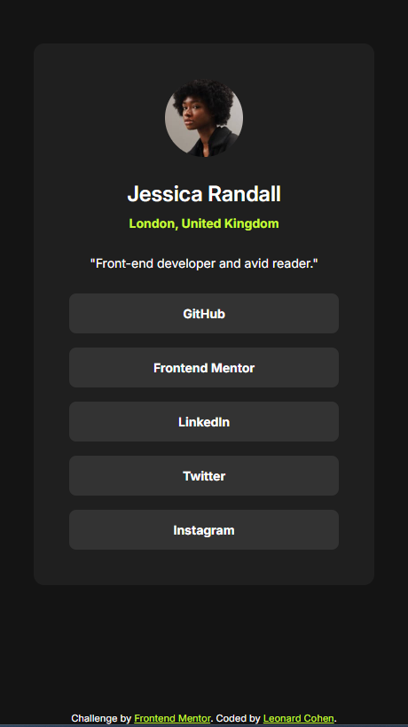

# Frontend Mentor - Social links profile solution

This is a solution to the [Social links profile challenge on Frontend Mentor](https://www.frontendmentor.io/challenges/social-links-profile-UG32l9m6dQ). Frontend Mentor challenges help you improve your coding skills by building realistic projects. 

## Table of contents

- [Overview](#overview)
  - [The challenge](#the-challenge)
  - [Screenshot](#screenshot)
  - [Links](#links)
- [My process](#my-process)
  - [Built with](#built-with)
  - [What I learned](#what-i-learned)
  - [Continued development](#continued-development)
- [Author](#author)

## Overview

### The challenge

Build a profile page with links to social media platforms.

### Screenshot

### Links

- Solution URL: [https://github.com/lenny131/social-links-profile](https://github.com/lenny131/social-links-profile)
- Live Site URL: [https://lenny131.github.io/social-links-profile](https://lenny131.github.io/social-links-profile)

## My process

### Built with

- HTML and CSS

### What I learned

A new style element introduced with this project was the animated change of the link button styles on hover, unlike the previous project where the style change was instantaneous. In this case, I was able to use the CSS `transition` property instead of using animations.

### Continued development

Continue practicing basic HTML/CSS/Javascript before starting on React and other Javascript and CSS libraries and frameworks.

## Author

- Website - [Leonard Cohen](https://leonardmcohen.com)
- Frontend Mentor - [lenny131](https://www.frontendmentor.io/profile/lenny131)
